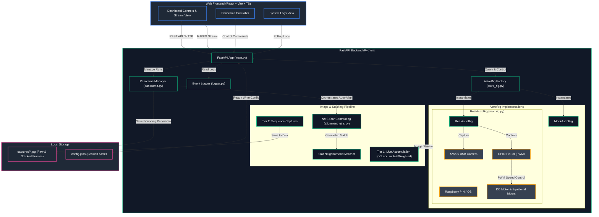

# AstroCam System Architecture

This document describes the architecture of the AstroCam automated astrophotography rig.

## System Components

## Description of Layers

1. **Web Frontend (React + TypeScript + Vite)**:
   * Dynamic single-page dashboard containing live preview stream, system logs, camera controls (exposure, gain, averaging), tracking speed presets, and panorama triggers.
2. **FastAPI Backend**:
   * **main.py**: REST endpoints serving status, controls, MJPEG live stream, and file gallery.
   * **AstroRig Factory**: Checks for connected hardware and dynamically provisions either the `RealAstroRig` or `MockAstroRig`.
   * **RealAstroRig**: Manages the OpenCV camera stream, real-time Tier 1 frame stacking/accumulation, and hardware GPIO PWM speed controls with ramping.
   * **MockAstroRig**: Generates a simulated starfield with mathematical celestial drift and noise for standalone developer testing.
3. **Alignment & Stacking Engine**:
   * **Star Neighborhood Descriptor**: A custom, high-speed geometric matching algorithm. It detects star centroids using Non-Maximum Suppression (NMS), creates rotation-invariant descriptors using nearest-neighbor relative coordinates, matches them, and calculates precise tracking offsets via RANSAC.
4. **Local Storage**:
   * Saves raw captured frames and finished panoramas to `captures/`.
   * Maintains session configuration (such as `rig_mode`) across backend restarts in `config.json`.

## Autoguiding & Calibration Mathematics

To track stars stably with an arbitrary camera orientation relative to the equatorial mount, AstroCam uses an online system identification and control loop:

### 1. System Model & Empirical Calibration
Let $u(t)$ be the motor duty cycle (control input) and $\mathbf{v}(t) = [v_x(t), v_y(t)]^T$ be the observed star drift velocity on the sensor (in pixels/second).
We model the change in drift velocity resulting from a change in duty cycle $\Delta u(t) = u(t) - u(t-\Delta t)$ as:
$$\Delta \mathbf{v}(t) \approx \mathbf{g} \cdot \Delta u(t)$$
where $\mathbf{g} = [g_x, g_y]^T$ is the **empirical mount response vector**. 
* The magnitude $\|\mathbf{g}\|$ represents the physical sensitivity (pixels/second per % duty cycle).
* The direction $\angle \mathbf{g}$ represents the Right Ascension (RA) axis orientation on the sensor.

### 2. Continuous Orientation Learning
To prevent Declination (Dec) drift (caused by polar misalignment) from biasing the RA calibration, we estimate $\mathbf{g}$ in difference-space using a **Normalized Least Mean Squares (NLMS)** update:
$$\mathbf{g}_{k+1} = \mathbf{g}_k + \alpha \cdot \frac{\Delta \mathbf{v}_k - \mathbf{g}_k \Delta u_k}{\Delta u_k^2 + \epsilon} \Delta u_k$$
* **Active Sensing Nudge**: When tracking starts, a small $+1.0\%$ duty cycle wiggle is applied for $1.5\text{s}$ to guarantee initial excitation ($\Delta u_k \neq 0$).
* **Variable Learning Rate (Gear-Shifting)**: We use $\alpha = 0.8$ during the first 5 steps for instant convergence, then shift to $\alpha = 0.1$ for long-term noise rejection.

### 3. Closed-Loop PD Tracking Control
Let $\mathbf{d}_k = [d_x, d_y]^T$ be the accumulated position error (drift) from the initial reference frame, and $\mathbf{v}_k$ be the current drift velocity.
We project the error and velocity vectors onto the calibrated RA axis ($\mathbf{g}$):
$$d_{RA} = \frac{\mathbf{d}_k \cdot \mathbf{g}}{\|\mathbf{g}\|}$$
$$v_{RA} = \frac{\mathbf{v}_k \cdot \mathbf{g}}{\|\mathbf{g}\|}$$
The motor duty cycle is corrected using a Proportional-Derivative (PD) feedback loop to prevent oscillations and ensure critical damping:
$$\Delta u_k = - K_p \cdot \frac{d_{RA}}{\|\mathbf{g}\|} - K_d \cdot \frac{v_{RA}}{\|\mathbf{g}\|} = - K_p \frac{\mathbf{d}_k \cdot \mathbf{g}}{\|\mathbf{g}\|^2} - K_d \frac{\mathbf{v}_k \cdot \mathbf{g}}{\|\mathbf{g}\|^2}$$
where $K_p = 0.05$ is the proportional gain, $K_d = 0.20$ is the derivative damping coefficient, and the correction step $\Delta u_k$ is clipped to $\pm 0.1\%$ for smooth operation.
