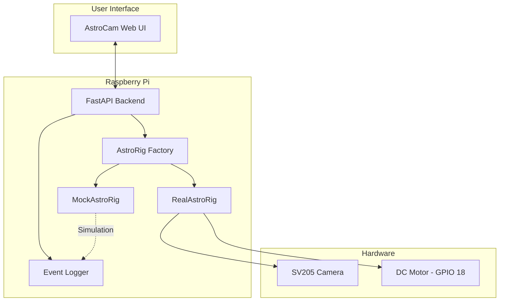
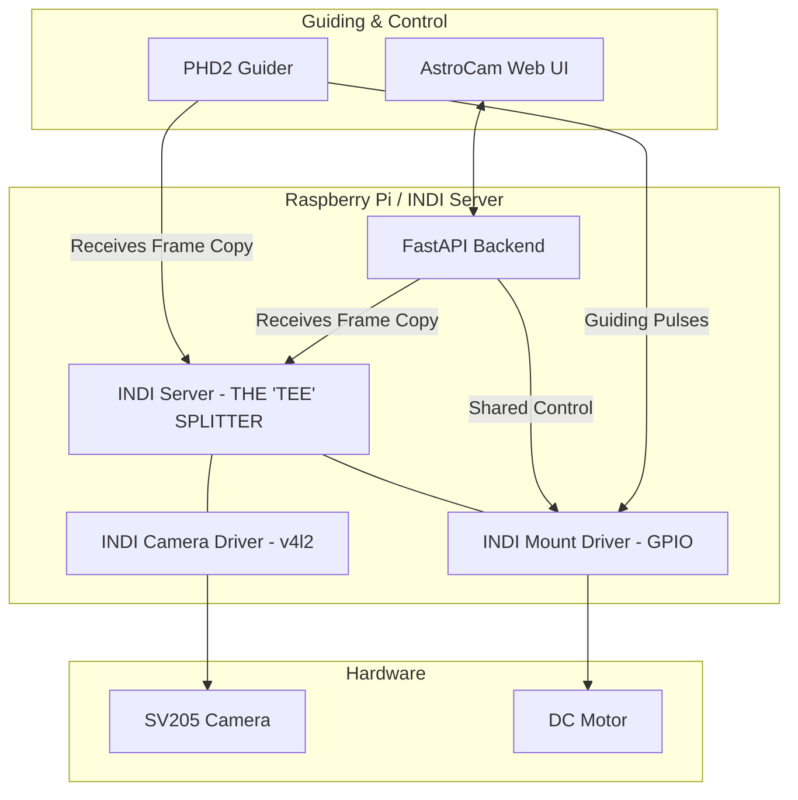
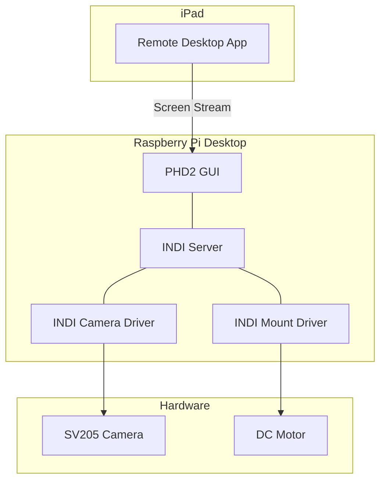

# AstroCam Architecture

## 1. Current (Planned) Architecture
This is the standalone setup where the AstroCam Web UI directly manages the camera and motors via a custom FastAPI backend.

## 2. PHD2 + INDI Integrated Architecture
In this setup, we introduce the **INDI Server** and **PHD2**. The hardware is abstracted behind INDI drivers, allowing professional astronomy software to collaborate with the AstroCam backend.

## 3. Full Native (Headless Desktop) Architecture
In this setup, you skip the custom Web UI entirely. You run a full Desktop environment on the Pi and access it via Remote Desktop (RDP/VNC) on your iPad.

### The "One Camera" Problem
In a professional setup, astronomers use **two cameras**:
1.  **Guide Camera:** Used by PHD2 to watch a star and calculate movement.
2.  **Imaging Camera:** Used by a separate program to take the actual photo.

**PHD2 does not save or stack images.** It "consumes" the image to find the star's center, then throws it away.

If you use your **SV205** for both, you have a conflict:
- **AstroCam** needs the camera to perform real-time stacking.
- **PHD2** needs the camera to perform guiding.
- **INDI** solves this by "sharing" the camera stream, but you are still limited: you can't have short exposures for guiding and long exposures for stacking at the same time on one camera.

## Integration Strategy: PHD2 & INDI

### 1. What is PHD2?
PHD2 (Push Here Dummy 2) is the industry-standard software for **autoguiding**. Its sole purpose is to keep a telescope mount perfectly locked onto a star during long-exposure astrophotography. It uses a guide camera to watch a star, detects microscopic drifts, and sends "nudge" commands to the mount's motors to correct them.

### 2. Why is PHD2 attractive for AstroCam?
- **Sub-pixel Accuracy:** PHD2 uses advanced math to detect star movement even smaller than a single pixel.
- **Closed-Loop Feedback:** Instead of just "guessing" the sidereal rate, PHD2 *looks* at the results and adapts to mechanical errors, wind, or poor alignment.
- **Ecosystem:** It is open-source and standard; using it connects AstroCam to the wider world of professional astronomy tools.

### 3. AstroCam vs. PHD2: Functional Roles
| Feature | AstroCam | PHD2 |
| :--- | :--- | :--- |
| **Primary Goal** | Stacking & Image Quality | Tracking & Mount Precision |
| **Data Handling** | Saves & Accumulates Frames | Consumes & Discards Frames |
| **Motor Control** | Presets (Sidereal/Panorama) | Micro-corrections (Guiding) |
| **What it DOESN'T do** | Predict mechanical tracking errors | Save pretty pictures or perform stacking |

### 4. Technical Requirements for Integration
To integrate PHD2 without losing AstroCam's specialized features, we must implement a **"Software Tee"** pattern using the **INDI Protocol**:

- **INDI Server:** Acts as the central hub (the Splitter).
- **The "Tee" Pattern:** The INDI server connects to the SV205 once and broadcasts copies of each frame to both AstroCam (for stacking) and PHD2 (for guiding).
- **Custom INDI Driver:** We need to wrap the `real_rig.py` GPIO logic into an INDI Mount Driver so PHD2 can send it pulses.
- **Backend Refactor:** The AstroCam backend must be updated to receive frames from the INDI server instead of opening `/dev/video0` directly.

### 5. Final Vision: The Hybrid Workflow
The user operates the **AstroCam Web UI** on an iPad for framing, stacking, and panoramas. Meanwhile, **PHD2** runs in the background (potentially viewed via Remote Desktop or a Laptop) to ensure those stacks are perfectly sharp and free of star trails.
