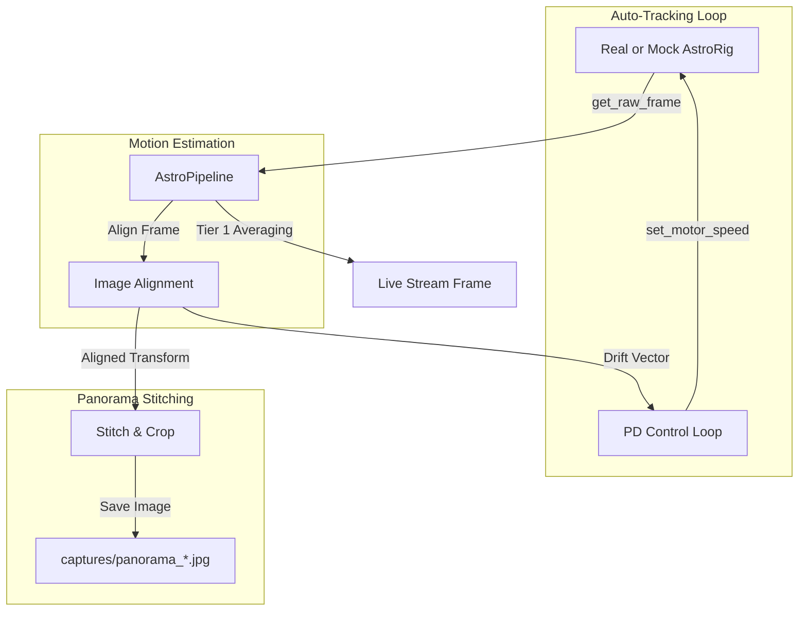

# Refactoring Plan: Unified Processing Pipeline

## 1. Objectives
* **Rig Decoupling:** Remove tracking, calibration, and simulation-only settings (`set_camera_angle`, `set_sim_drift`) from the [BaseAstroRig](file:///home/kio/projects/astrocam/backend/base_rig.py) and [RealAstroRig](file:///home/kio/projects/astrocam/backend/real_rig.py) classes. Only [MockAstroRig](file:///home/kio/projects/astrocam/backend/mock_rig.py) will define simulated properties.
* **Pipeline Integration:** Create a unified `AstroPipeline` that acts as the single image processing and motion estimation engine.
* **Consolidated Motion Estimation:** Perform image alignment once per frame when either tracking or panorama is active, avoiding redundant computations.
* **Hardware Abstraction:** Rigs will focus strictly on raw frame acquisition and physical/simulated hardware control (e.g. motor PWM speed, gain, exposure).

---

## 2. Architecture Diagram

---

## 3. Implementation Steps

### Phase 1: Simplify Rig Interfaces
* Modify [BaseAstroRig](file:///home/kio/projects/astrocam/backend/base_rig.py):
  * Remove `set_auto_tracking`, `get_tracking_status`, `set_camera_angle`, and `set_sim_drift`.
* Modify [RealAstroRig](file:///home/kio/projects/astrocam/backend/real_rig.py) and [MockAstroRig](file:///home/kio/projects/astrocam/backend/mock_rig.py):
  * Remove `_update_tracking` method and all tracking/calibration state variables.
  * Make `MockAstroRig` keep `set_camera_angle` and `set_sim_drift` as local helper methods.
  * Rig capture loops will simply retrieve the raw camera or simulated frame, and update a local thread-safe `raw_frame`.

### Phase 2: Design `AstroPipeline` (`pipeline.py`)
* Create `backend/pipeline.py` with `AstroPipeline` class.
* Implement:
  * **Frame Fetching:** A background thread that fetches raw frames from the active rig.
  * **Tier 1 Stacking:** Real-time accumulation (`cv2.accumulateWeighted`) to populate the `latest_frame` for the live view.
  * **Unified Motion Estimation:** Alignment computations (`align_images`) when tracking or panorama is enabled.
  * **Auto-Tracking Control:** The PD-style closed-loop controller (`self.calib_g`, calibration updates, excitation nudge, duty cycle adjustment).
  * **Panorama Accumulation:** Integrating or driving the panorama capture steps directly off the aligned pipeline frame sequence.

### Phase 3: Update `main.py` & Endpoints
* Adapt global variables: the global `rig` acts as the hardware interface, and a global `pipeline = AstroPipeline(rig)` runs the processing.
* Route API calls:
  * `/tracking/toggle` and `/tracking/status` go directly to the `pipeline`.
  * `/mock/camera_angle` and `/mock/sim_drift` check `if hasattr(rig, 'set_camera_angle')` and execute.
  * `/stream` gets binned/processed frames from the `pipeline`.
